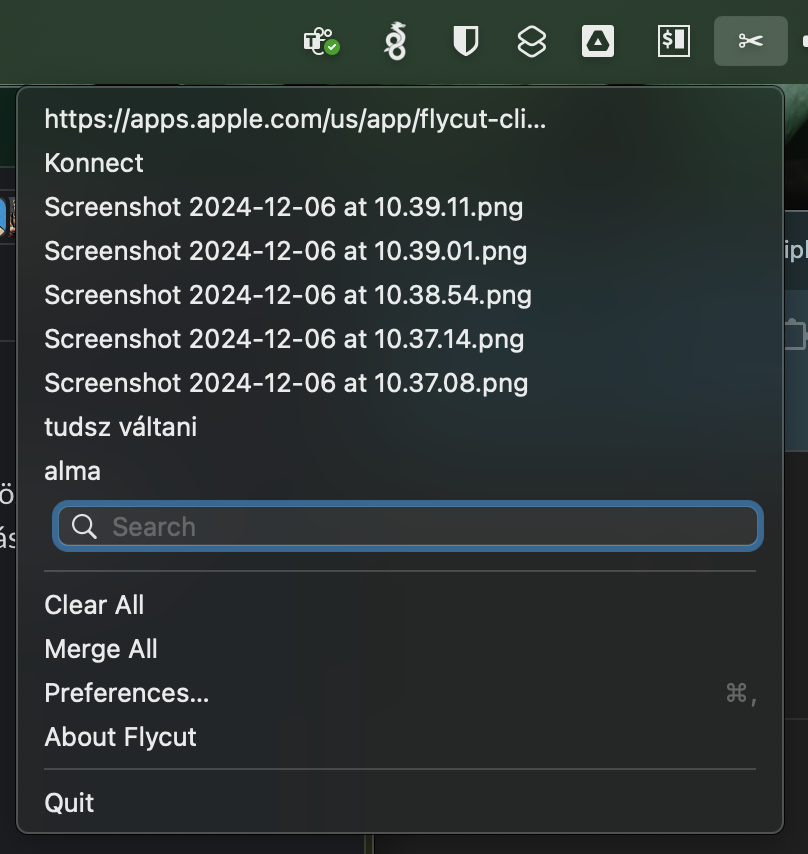
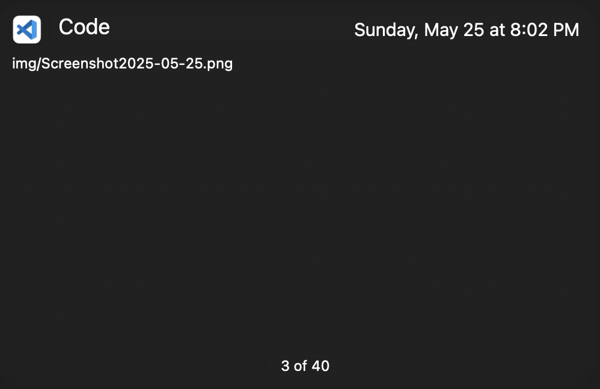

## Mail Client

Spark :)

## Filemanager

(Nekem a Total Commander még mindig hiányzik :/ )
[https://doublecmd.sourceforge.io](https://doublecmd.sourceforge.io/) → ez egész Total Commanderes :)   
 Raycast app, spotlight replacement, sok-sok tuti pluginnel
 Warp terminal app. iTerm és Terminal kuka

## Moving window by clicking anywhere

It can be enabled by running the following command:  
``` console
defaults write \-g NSWindowShouldDragOnGesture \-bool true  
```
You can then `cmd + ctrl + click` on any part of a window to move it. (új Intellij-n nem működik, minden másra jó)  
[https://mmazzarolo.com/blog/2022-04-16-drag-window-by-clicking-anywhere-on-macos/](https://mmazzarolo.com/blog/2022-04-16-drag-window-by-clicking-anywhere-on-macos/)

## Clipboard history

FlyCut \- minimalista clipboard history  
`Cmd+Shift+V` → nyomva tartod a `Cmd+Shift` és nyilakkal tudsz navigálni historyban  
Amikor elengeded (formázatlanul) beszúrja a kiválasztott elemet.  
[https://apps.apple.com/us/app/flycut-clipboard-manager/id442160987?mt=12](https://apps.apple.com/us/app/flycut-clipboard-manager/id442160987?mt=12)  



## Terminal

https://www.warp.dev

Egy AI suggestionnel megpimpelt terminál egész szerethető! 