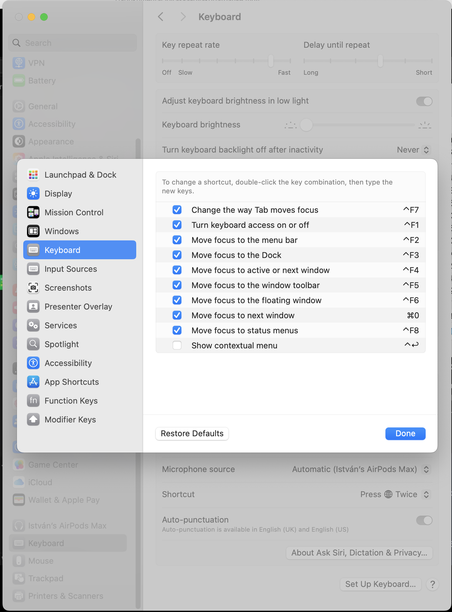
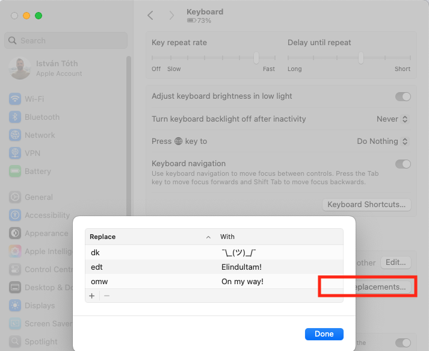
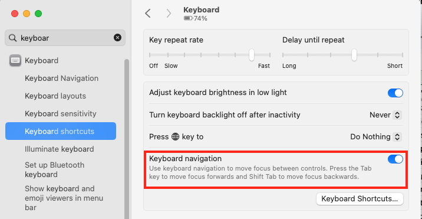
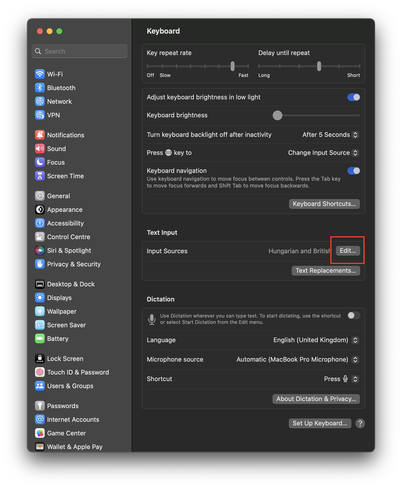
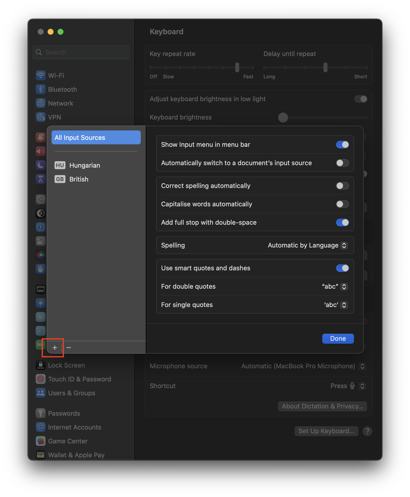
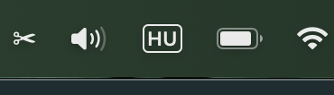
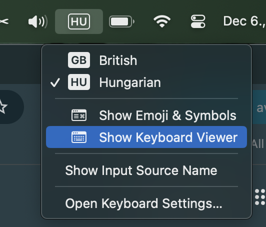
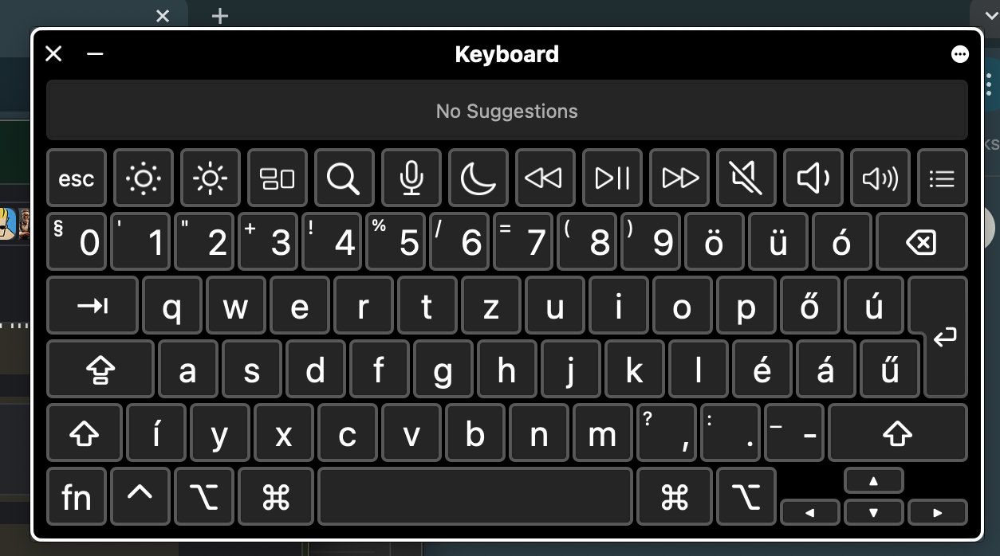

### Billentyűkombó több példányban futó alkalmazások váltására

`CMD+Tab` ugye az ablak váltás, mint windowsban az alt+tab, viszont ha egy alkalmazásból több különböző ablak van nyitva akkor a `CMD+Tab` nem vált közöttük. Alkalmazáson belüli ablakok váltásra gyorsbillentyűt be lehet állítani, nekem ez a `CMD+0`-ra van mappelve. (Move focus to next window)  

### Billentyűzet \- Text replacement (lehetne értelmesebbre is használni :D)

Beírom hogy dk és utána space és ez lesz belőle ¯\\\_(ツ)\_/¯   

omail --> own.mail@gmail.com

### Felugró ablakon ha vannak gombok, azok között Tab-bal lehessen váltani:

### Virtual billentyűzet, kiosztás megszokásához :keyboard: 

Új mac-es koromban rengeteget segített a beépített interaktív virtual keyboard, ami segít megtalálni a special karaktereket.

1. Vedd fel a US/GB kiosztást (sokkal jobb programozni, mint a magyar\!\!\!)  

2. Megjelenik tálcán a nyelv ikon (fn gombbal VAGY `Ctrl+Option+Space` tudsz váltani nyelvet)   

3. Lenyitva megnyitható az interaktív billentyűzet  
4. (Itt én annyival egészítettem ki: `System Preferences / Accessibility / Shortcut` → a listából mindent kivettem, csak a az Accessibility Keyboard maradt) → Ez után a `System Preferences / Keyboard / Shortcuts / Show Accessibility Options shortcut` ra állított kombináció ilyenkor csak a virtual billentyűzetet fogja előhozni vagy eltüntetni.)

### Billentyű kiosztás windows like (sajnálom én így csinálom)

Szóval, ha megtanultál vakon gépelni EN vagy HU bill kiosztáson, akkor a mac-et is át lehet állítani, hogy ott legyenek a spéci karakterek, ahol a “Windows”-ban volt, ekkor az `Option = Alt` billentyű és így az `Option + v` = @, `Option + x` = # stb.... (és akkor nem szívsz a `cmd+Q` vs `option+Q` val :P)   
[http://www.macmag.hu/hpro/](http://www.macmag.hu/hpro/)