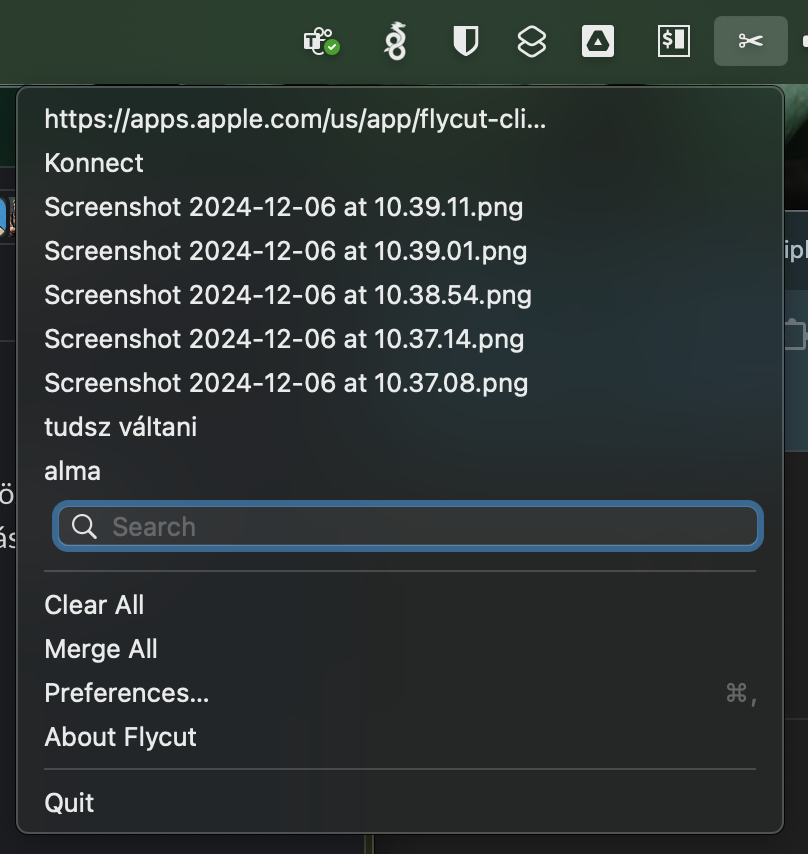

macOS tippek, trükkök, praktikák

### Billentyűkombó több példányban futó alkalmazások váltására

`CMD+Tab` ugye az ablak váltás, mint windowsban az alt+tab, viszont ha egy alkalmazásból több különböző ablak van nyitva akkor a `CMD+Tab` nem vált közöttük. Alkalmazáson belüli ablakok váltásra gyorsbillentyűt be lehet állítani, nekem ez a `CMD+0`-ra van mappelve. (Move focus to next window)  


### Billentyűzet \- Text replacement (lehetne értelmesebbre is használni :D)

Beírom hogy dk és utána space és ez lesz belőle ¯\\\_(ツ)\_/¯   


omail --> own.mail@gmail.com

### Felugró ablakon ha vannak gombok, azok között Tab-bal lehessen váltani:


### Screenshot shortcut

én mindig képernyő részletet akarok kivágni `Shift+Cmd+4` ennek hatására feljön egy célkereszt és így lehet részeket kivágni gyorsan.   
Ha kijelölés közben nyomva tartod a Control-t akkor egyből clipboard-ra kerül a kép

(Lehet teljes screent \+ teljes ablakot \+ by default tud screen recording videót is ez `Shift+Cmd+5` itt külön be lehet állítani h microfon vegyen hangot v sem)   
Bővebben: [https://support.apple.com/en-us/102646](https://support.apple.com/en-us/102646)  
Terminálon be lehet állítani, hogy hova mentse a Screenshotokat, nekem a Desktopon van egy Screenshots mappa és ebbe kerül minden, nem a Desktopra szemetelek, szóval **létre kell hozni a foldert** ahova menteni akarod, majd **Terminal**ban:   
``` console
defaults write com.apple.screencapture location /Users/tothi/Desktop/Screenshots  
killall SystemUIServer
```
### Billentyű kiosztás windows like (sajnálom én így csinálom)

Szóval, ha megtanultál vakon gépelni EN vagy HU bill kiosztáson, akkor a mac-et is át lehet állítani, hogy ott legyenek a spéci karakterek, ahol a “Windows”-ban volt, ekkor az `Option = Alt` billentyű és így az `Option + v` = @, `Option + x` = # stb.... (és akkor nem szívsz a `cmd+Q` vs `option+Q` val :P)   
[http://www.macmag.hu/hpro/](http://www.macmag.hu/hpro/)

### Virtual billentyűzet, kiosztás megszokásához :keyboard: 

Új mac-es koromban rengeteget segített a beépített interaktív virtual keyboard, ami segít megtalálni a special karaktereket.

1. Vedd fel a US/GB kiosztást (sokkal jobb programozni, mint a magyar\!\!\!)  

2. Megjelenik tálcán a nyelv ikon (fn gombbal VAGY `Ctrl+Option+Space` tudsz váltani nyelvet)   

3. Lenyitva megnyitható az interaktív billentyűzet  
4. (Itt én annyival egészítettem ki: `System Preferences / Accessibility / Shortcut` → a listából mindent kivettem, csak a az Accessibility Keyboard maradt) → Ez után a `System Preferences / Keyboard / Shortcuts / Show Accessibility Options shortcut` ra állított kombináció ilyenkor csak a virtual billentyűzetet fogja előhozni vagy eltüntetni.)


### Watch \+ MacOs :watch:+:computer:

Ha használtok apple watchot akkor be lehet állítani, hogy az óra unlockolja a gépet, hogy még azt a nehéz mozdulatot se kelljen megtenned, hogy az ujjlenyomat olvasóra helyezed az ujjad.   
[https://support.apple.com/en-lamr/102442](https://support.apple.com/en-lamr/102442)

### Macbook lockolása :lock::computer:

Ha az ujjlenyomat olvasót megnyomod akkor lelockolja a gépet :D Én ezt nem tudtam és a Zoli mutatta anno. 

### Copy+paste Apple eszközök között pl. iPhone vs Macbook :iphone::on::computer:

Ha ugyanazzal az appleId-val vagy bejelentkezve az eszközeiden, akkor tudja szinkronizálni az eszközök között a vágólapot. UseCase pl nálam amit szeretek, kártyás fizetés Revolut eldobható kártyával. Telon kimásolom a kártya adatokat, macen meg CMD+V-vel beillesztem.   
[https://support.apple.com/en-gb/guide/mac-help/mchl70368996/mac](https://support.apple.com/en-gb/guide/mac-help/mchl70368996/mac)

## Mail Client

Spark :)

## Filemanager

(Nekem a Total Commander még mindig hiányzik :/ )
[https://doublecmd.sourceforge.io](https://doublecmd.sourceforge.io/) → ez egész Total Commanderes :)   
 Raycast app, spotlight replacement, sok-sok tuti pluginnel
 Warp terminal app. iTerm és Terminal kuka

## Moving window by clicking anywhere

It can be enabled by running the following command:  
``` console
defaults write \-g NSWindowShouldDragOnGesture \-bool true  
```
You can then `cmd + ctrl + click` on any part of a window to move it. (új Intellij-n nem működik, minden másra jó)  
[https://mmazzarolo.com/blog/2022-04-16-drag-window-by-clicking-anywhere-on-macos/](https://mmazzarolo.com/blog/2022-04-16-drag-window-by-clicking-anywhere-on-macos/)

## Clipboard history

FlyCut \- minimalista clipboard history  
`Cmd+Shift+V` → nyomva tartod a `Cmd+Shift` és nyilakkal tudsz navigálni historyban  
Amikor elengeded (formázatlanul) beszúrja a kiválasztott elemet.  
[https://apps.apple.com/us/app/flycut-clipboard-manager/id442160987?mt=12](https://apps.apple.com/us/app/flycut-clipboard-manager/id442160987?mt=12)  



